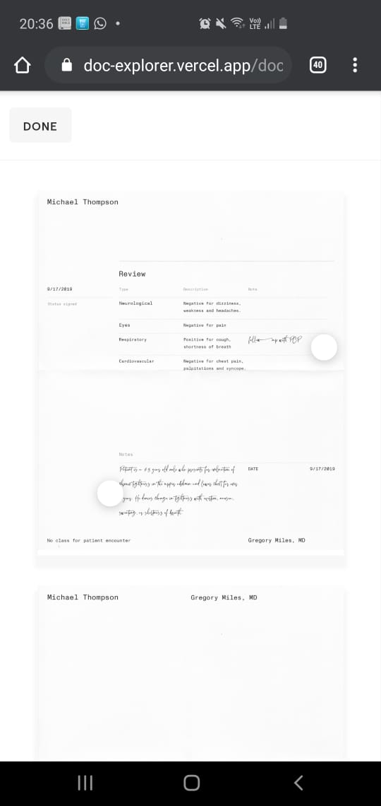
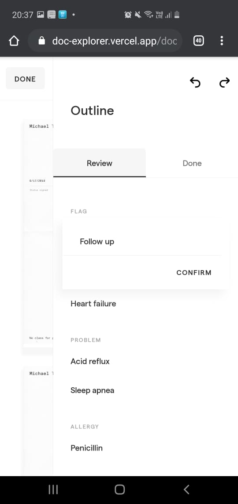

## Installation

This project was built using NodeJS 12.14.1 and yarn 1.16.0, be sure to run compatible versions.

First, start by installing dependencies:

```bash
yarn install
```

Once that's ready, you can run the project with the following command:

```bash
yarn dev
```

Open [http://localhost:3000](http://localhost:3000) with your browser to see the result.

You can also access a live version at [https://doc-explorer.vercel.app/](https://doc-explorer.vercel.app/)

## Dependencies

The project uses [NextJS](https://nextjs.org/) as the basic framework. The choice was based around two facts:

- NextJS allowed me to start real quick with an application skeleton
- NextJS comes packed with a server which allowed me to implement a simple endpoint for data retrieval

The project uses [styled-components](https://styled-components.com/). This is more a matter of preference, however it may have been better to just copy the styles in the source code provided, although when I realized that I was already too deep into the project.

To handle async data fetching I'm using [React Query](https://react-query.tanstack.com/) which makes this easy. Together with React Query I'm using [Axios](https://github.com/axios/axios) as a low level fetch api for no particular reason other than preference.

Finally for the Lottie animations I'm using [Lottie React](https://github.com/LottieFiles/lottie-react), a library that provides a React component to handle Lottie animations.

## Challenges

By far the most challenging part of this project has been the animations. I tried using the same library as the one used by the provided source code but it was misbehaving with NextJS so I switched for the library I'm currently using.

However this library also presents some problems:
- The `hover` prop in the `Player` component does not work at all.
- The `Player` never fired the completed state which I could have used to overcome the above bug.

I tried a couple more solution (like manually registering a hover event handler using the `lottieRef` prop) but none of them worked. Finally I decided to move on, although with a bittersweet taste in my mouth.

## Enhancements

The application is mostly a migration of the provided example, though I took the liberty of making two small changes which I think could improve the general UX.

### Fixed top bar

The top bar is fixed now. The rationale behind this is that the docs mention that documents can be as long as 50 pages. In such case, if a user has scrolled all the way down and wants to navigate out of the document explorer they are not forced to scroll back up. Another alternative could have been to include a button to automatically scroll to the top, but this would have required one more user interaction (one click to scroll to the top and a second click to actually navigate out of the page).

### Improved mobile experience

In cases where the users is navigating from a device with low resolution the layout adapts to make a better use of the screen. More specifically, when the device width is less than 1024px the Outline panel is hidden by default:



If the user clicks any of the dots then the Outline panel opens:



Finally, clicking outside of the outline panel will close it.

## Known Issues

- Some animations were not migrated. This is particularly true about the Lottie animations, but also some other animations are missing too (the ones using jQuery, and some animation related to the cards and tabs).
- At the bottom of each page there seems to be a white gap which shouldn't probably be there.

## License

The MIT License (MIT) Copyright (c) 2020 Sebastian Urbina

Permission is hereby granted, free of charge, to any person obtaining a copy of this software and associated documentation files (the "Software"), to deal in the Software without restriction, including without limitation the rights to use, copy, modify, merge, publish, distribute, sublicense, and/or sell copies of the Software, and to permit persons to whom the Software is furnished to do so, subject to the following conditions:

The above copyright notice and this permission notice shall be included in all copies or substantial portions of the Software.

THE SOFTWARE IS PROVIDED "AS IS", WITHOUT WARRANTY OF ANY KIND, EXPRESS OR IMPLIED, INCLUDING BUT NOT LIMITED TO THE WARRANTIES OF MERCHANTABILITY, FITNESS FOR A PARTICULAR PURPOSE AND NONINFRINGEMENT. IN NO EVENT SHALL THE AUTHORS OR COPYRIGHT HOLDERS BE LIABLE FOR ANY CLAIM, DAMAGES OR OTHER LIABILITY, WHETHER IN AN ACTION OF CONTRACT, TORT OR OTHERWISE, ARISING FROM, OUT OF OR IN CONNECTION WITH THE SOFTWARE OR THE USE OR OTHER DEALINGS IN THE SOFTWARE.
